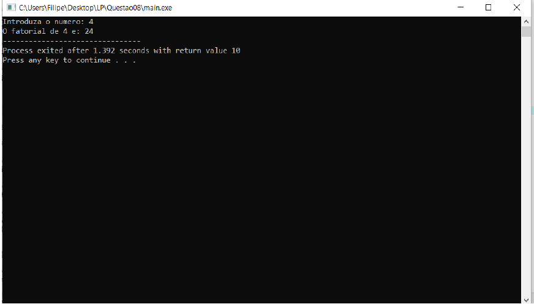

# Fatorial-sub-rotina-
### Utilização do conceito matematico Fatorial mas o cálculo do fatorial é efetuado dentro de uma sub-rotina.
Trabalho desenvolvido para cimentar os conhecimentos adquiridos nas cadeiras de Linguagens de Programação e Algoritmos e Estruturas de Dados.

**O objetivo da aplicação consiste em solicitar ao utilizador um numero inteiro e mostrar o resultado do fatorial desse número, sendo o calculo efetuado dentro de uma sub-rotina**

Se quiser utilizar o programa basta:
* Executar o ficheiro denominado "main.exe".

Aqui tem um exemplo do programa em execução:

